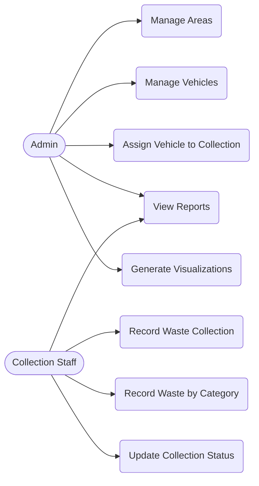
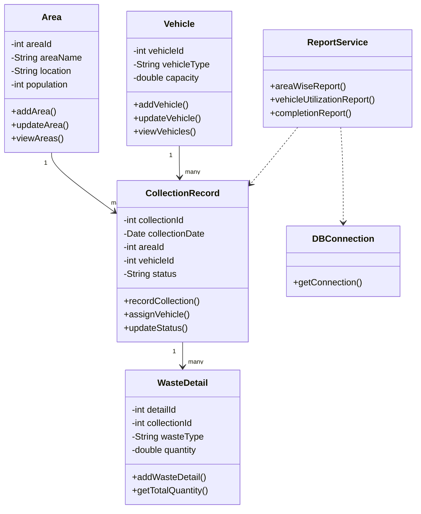
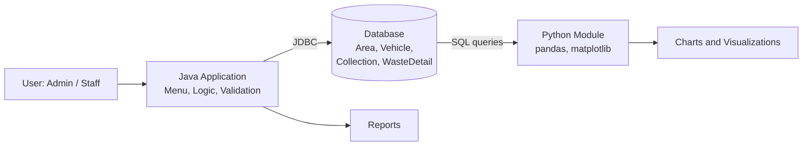

# Design Diagrams

## 1. Use Case Diagram

```mermaid
flowchart LR
    A([Admin])
    S([Collection Staff])

    A --> U1(Manage Areas)
    A --> U2(Manage Vehicles)
    A --> U3(Assign Vehicle to Collection)
    A --> U4(View Reports)
    A --> U5(Generate Visualizations)

    S --> U6(Record Waste Collection)
    S --> U7(Record Waste by Category)
    S --> U8(Update Collection Status)
    S --> U4
```

## 2. Class Diagram

```mermaid
classDiagram
    class Area {
        -int areaId
        -String areaName
        -String location
        -int population
        +addArea()
        +updateArea()
        +viewAreas()
    }
    class Vehicle {
        -int vehicleId
        -String vehicleType
        -double capacity
        +addVehicle()
        +updateVehicle()
        +viewVehicles()
    }
    class CollectionRecord {
        -int collectionId
        -Date collectionDate
        -int areaId
        -int vehicleId
        -String status
        +recordCollection()
        +assignVehicle()
        +updateStatus()
    }
    class WasteDetail {
        -int detailId
        -int collectionId
        -String wasteType
        -double quantity
        +addWasteDetail()
        +getTotalQuantity()
    }
    class ReportService {
        +areaWiseReport()
        +vehicleUtilizationReport()
        +completionReport()
    }
    class DBConnection {
        +getConnection()
    }

    Area "1" --> "many" CollectionRecord
    Vehicle "1" --> "many" CollectionRecord
    CollectionRecord "1" --> "many" WasteDetail
    ReportService ..> CollectionRecord
    ReportService ..> DBConnection
```

## 3. System Architecture

```mermaid
flowchart LR
    U[User: Admin / Staff] --> J[Java Application<br/>Menu, Logic, Validation]
    J -->|JDBC| D[(Database<br/>Area, Vehicle,<br/>Collection, WasteDetail)]
    D -->|SQL queries| P[Python Module<br/>pandas, matplotlib]
    P --> V[Charts and Visualizations]
    J --> R[Reports]
```
